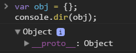

# Chapter2 리터럴와 생성자

## 생성자 사용을 자제하고 대신 리터럴 표기법을 사용하자

## 1. 객체 리터럴

* 자바스크립트에서 '객체'란 이름-값 쌍의 해시 테이블을 생각하면 된다.
* 원시 데이터 타입, 객체, 함수 모두 값이 될 수 있고 값이 되는 함수를 **메서드**라고 한다.

``` js
// 빈 객체에서 시작
var dog = {};

// 프로퍼티 하나를 추가
dog.name = "Benji";

// 메서드 추가
dog.getName = function() {
	return dog.name;
};
```

위 예제는 빈 객체에서 시작했고 프로퍼티와 메서드를 추가
프로그램 생명주기 중 어느 떄라도 다음과 같은 일을 할 수 있다.

``` js
// 프로퍼티와 메서드 값을 변경
dog.getName = function() {
	// 메서드가 하드코딩("Fido")된 값을 반환하도록 재정의
	return "Fido";
};

// 프로퍼티나 메서드 삭제
delete dog.name;

// 다른 프로퍼티나 메서드를 추가한다.
dog.say = function() {
	return "Woof!";
};
dog.fleas = true;
```

**반드시 빈 객체에서 시작해야 하는 것이 아니다.**
객체 리터럴 표기법을 쓰면 다음 예제처럼 생성 시점에 객채에 기능을 추가 할 수 있다.

``` js
var dog = {
	name: "Benji",
	getName: function () {
		return this.name;
	}
};
```

*책에서 `빈 객체`표현은 간결성을 위한 것이며 자바스크립트에서는 빈 객체가 없다. `{}` 객체조차도 이미 `Object.prototype`에서 상속받은 프로퍼티와 메서드를 가진다. 비어있다는 말은 어떤 객체가 상속받은 것 외에는 자기 자신의 프로퍼티를 갖고 있지 않다는 뜻*



### 1-1) 객체 리터럴 문법

* 객체를 중괄호({와})로 감싼다.
* 객체 내의 프로퍼티와 메서드를 쉼표(,)로 분리한다. 마지막 이름-값 쌍 뒤에 쉼표가 들어가면 ***IE7이하***에서는 에러가 발생하므로, 마지막에는 사용하지 말아야 한다.
* 프로퍼티명과 프로퍼티 값을 콜론(`:`)으로 분리
* 객체를 변수에 할당할 때는 닫는 중괄호 뒤에 세미콜론(`;`)을 빼먹지 말자.

### 1-2) 생성자 함수로 객체 생성하기

객체를 생성할 때는 직접 만든 생성자 함수를 사용할 수도 있고, `Object(), Date(), String()`등 내장 생성자를 사용할 수도 있다.
다음 예제는 동일한 객체를 생성하는 두 가지 방법

``` js
// 첫번째 방법 : 리터럴 사용
var car = {goes: "far"};

// 다른 방법 - 내장 생성자 사용 ( 안티 패턴 )
var car = new Object();
car.goes = "far";
```

* 객체 리터럴 표기법이 더 짧다.
* 객체란 변경가능한 해시에 불과하며 특별한 것이 아니다.
* 리터럴 표기법을 사용하면 유효범위 판별 작업도 발생하지 않는다.(위 예제에서 스코프내 Object()가 중복되는지 확인 한다는건가요?)

### 1-3) 객체 생성자의 함정

문제의 기능은 `Object()` 생성자가 인자를 받을 수 있다는 점이다. 인자로 전달되는 값에 따라 생성자 함수가 다른 내장 생성자에 객체 생성을 위임할 수 있고, 따라서 기대한 것돠는 다른 생성자로 생성된 객체가 반환된다.

``` js
// 모두 안티 패턴

// 빈 객체
var o = new Object();
console.log(o.constructor === Object); // true

// 숫자 객체
var o = new Object(1);
console.log(o.constructor === Number); // true
console.log(o.toFixed(2)); // "1.00"

// 문자열 객체
var o = new Object("I am a string");
console.log(o.constructor === String); // true
console.log( typeof o.substring); // "function"

// 불린 객체
var o = new Object(true);
console.log(o.constructor === Boolean); // true
```

`o.constructor`의 값이 다 다르다.
***new Object()를 사용하지 마라.***

## 2. 사용자 정의 생성자 함수

직접 생성자 함수를 만들어 객체 생성하기

``` js
var adam = new Person("Adam");
adam.say(); // "I am Adam"
```

생성자 함수 정의

``` js
var Person = function(name) {
	this.name = name;
	this.say = function() {
		return "I am " + this.name;
	};
};
```

new와 함께 생성자 함수를 호출하면 함수안에서 다음과 같은 일이 일어난다.

* 빈 객체 생성. 이 객체는 this라는 변수로 참조할 수 있고, 해당 함수의 프로토타입을 상속받는다.
* this로 참조되는 객체에 프로퍼티와 메서드가 추가된다.
* 마지막에 다른 객체가 명시적으로 반환되지 않을 경우, this로 참조된 이 객체가 반환된다.

실제로 풀어보면 다음과 같이 진행

``` js
var Person = function (name) {
	// 객체 리터럴로 새로운 객체 생성
	// var this = {};
	// var this = Object.create(Person.prototype);
	// 빈 객체라는 게 실제로는 텅 빈 겂이 아니기 때문

	// 프로퍼티와 메서드를 추가한다.
	this.name = name;
	this.say = function () {
		return "I am" + this.name;
	};

	// this를 반환
	// return this;
};
```

이 예제는 간단히 `say()`라는 메서드를 this에 추가했다. 결과적으로 `new Person()`을 호출할때마다 메모리에 새로운 함수가 생성 비효율적이므로 이 메서드는 Person의 프로토타입에 추가하는 것이 낫다.

``` js
Person.prototype.say = function () {
	return "I am" + this.name;
};
```

### 2-1) 생성자의 반환 값

* 생성자 함수를 new와 함께 호출하면 항상 객체 반환
* 기본값은 `this`로 참조되는 개체
* 생성자 함수 내에서 아무런 프로퍼티나 메서드를 추가하지 않았다면 '빈' 객체 반환
* 함수 내에 `return`문을 쓰지 않았더라도 생성자는 암묵적으로 `this`반환
* 반환 값이 될 객체를 따로 정할 수도 있다.

다음 예제에서는 새로운 객체를 생성하여 `that`으로 참조하고 반화하는것을 볼 수 있다.

``` js
var Objectmaker = function () {
	// 생성자가 다른 객체를 대신 반환하기로 결정했기 때문에 다음의 `name`프로퍼티는 무시
	this.name = "This is it";

	// 새로운 객체를 생성하여 반환
	var that = {};
	that.name = "And that's that";
	return that;
}

// test
var o = new Objectmaker();
console.log(o.name); // "And that's that"
```

생성자에서는 어떠한 객체라도 반환할 수 있고 객체가 아닌 것을 반환하려고 시도하면, 그냥 무시하고 this에 의해 참조된 객체가 대신 반환

## 3. new를 강제하는 패턴

`new`를 빼먹으면 생성자 내부의 `this`가 전역 객체를 가리키게 된다. (브라우저에서라면 this가 window를 가리키게 된다.)

``` js
// 생성자
function Waffle() {
	this.tastes = "yummy";
}

// 새로운 객체
var good_morning = new Waffle();
console.log(typeof good_morning); // "object"
console.log(good_morning.tastes); // "yummy"

// 안티패턴
// `new`를 생략
var good_morning = Waffle();
console.log(typeof good_morning); // "undefined"
console.log(window.tastes); // "yummy"
```

ECMAScript 5에서는 이러한 동작 방식의 문제에 대한 해결책으로, strict mode에서는 this가 전역 객체를 가리키지 않도록 했다.

### 3-1) 명명 규칙

생성자 함수명의 첫글자를 대문자로 쓰고 일반적임 함수와 메서드의 첫글자는 소문자를 사용

### 3-2) that 사용

명명 규칙을 따라는것은 권고할 뿐 강제하지는 못한다. 생성자가 항상 생성자로 동작하도록 해주는 패턴을 살펴보자.

``` js
function Waffle() {
	var that = {};
	that.tastes = "yummy";
	return that;
}

function Waffle() {
	return {
		tastes: "yummy"
	};
}

var first = new Waffle(),
	second = Waffle();
console.log(first.tastes); // 'yummy'
console.log(second.tastes); // 'yummy'
```

문제는 프로토타입과의 연결고리를 잃어버린다.
즉 `Waffle()` 프로토타입에 추가한 멤버를 객체에서 사용할 수 없다.

### 3-3) 스스로를 호출하는 생성자

생성자 내부에서 `this`가 해당 생성자의 인스턴스인지 확인하고 그렇지 않은 경우 new와 함께 스스로를 재호출

``` js
function Waffle() {
	if(!(this instanceof Waffle)) {
		return new Waffle();
	}

	this.tastes = "yummy";
}
Waffle.prototype.wantAnother = true;

// 호출 확인
var first = new Waffle(),
	second = Waffle();

console.log(first.tastes); // 'yummy'
console.log(second.tastes); // 'yummy'

console.log(first.wantAnother); // true
console.log(second.wantAnother); // true
```

`new Waffle()`일떄 this는 `Waffle()`
`Waffle()`일떄 this는 `window`

## 4. 배열 리터럴

* 자바스크립트 배열은 객체다.
* 내장 생성자인 `Array()`로도 배열을 생성할 수 있고 리터럴 표기법도 있다.
* 객체 리터럴과 마찬가지도 배열 리터럴 표기법이 더 간단하고 장점이 많다.

`Array()` 생성자와 리터럴 패턴을 사용하여 동일한 원소를 가지는 배열 두 개를 만드는 방법

``` js
// 안티패턴
var a = new Array("itsy", "bitsy", "spider");

// 위와 똑같은 배열
var a = ["itsy", "bitsy", "spider"];

console.log(typeof a); // 배열도 객체이므로 "object"
console.log(a.constructor === Array); // true
```
### 4-1) 배열 리터럴 문법

* 각 원소는 쉼표로 분리하고 전체 목록을 대괄호로 감싼다.
* 객체나 다른 배열 등 어떤 타입의 값이든 배열 원소로 지정할 수 있다.
* 배열이란 0에서 인덱스를 시작하는 값의 목록

### 4-2) 배열 생성자의 특이성

* `Array()` 생성자에 숫자 하나를 전달할 경우, 이 값은 배열의 첫번째 원소 값이 되는게 아니라 배열의 길이를 지정한다.(즉 `new Array(3)`은 길이가 3이고 실제 원소 값은 가지지 않은 배열)

``` js
// 한 개의 원소를 가지는 배열
var a = [3];
console.log(a.length); // 1;
console.log(a[0]); // 3;

// 세 개의 원소를 가지는 배열
var a = new Array(3);
console.log(a.length) // 3
console.log(typeof a[0]); // "undefined"

// new Array()에 정수가 아닌 부동소수점을 가지는 수를 전달 시 에러 발생

// 리터럴 사용
var a = [3.14];
console.log(a[0]); // 3.14

var a = new Array(3.14); // error

console.log(typeof a); // "undefined"
```

모르겠다?

***그러나 ArrayO 생성자를 독창적으로 활용하는 사례들도 있다. 예를 들면 다음 코드
조각을 실행시키면 255개의 공백문자로 이루어진 문자열을 반환한다. (왜 256개가
아닌지는 독자 여 러분의 판단에 맡기겠다.)
var white = new Array(256).join( ‘ ‘ ) ;***

### 4-3) 배열인지 판별하는 방법

배열에 `tyepof`연산자를 사용하여 "object"가 반환

`console.log(typeof [1, 2]); // "object"`

ECMAScript5에서는 `Array.isArray()``라는 새로운 메서드가 정의 이 메서드는 인자가 배열이면 `true`를 반환.

``` js
Array.isArray([]); // true

// 배열과 비슷한 객체로 속여본다.
Array.isArray({
	length: 1,
	"0", 1,
	slice: function () {}
}); // false가 반환
```

실행환경에서 이 메서드를 사용할 수 없는 경우(지원하지 않은 경우)에는 `Object.prototype.toString()`메서드를 호출하여 판별할 수 있다. 배열에 `toString`를 호출하면 "`[object Array]`"라는 문자열을 반환한다.
객체일 경우에는 문자열 "`[object Object]`"가 반환된다.

``` js
if (typeof Array.isArray === "undefined") {
	Array.isArray = function (arg) {
		return Object.prototype.toString.call(arg) === "[object Array]"; // true or false 반환
	};
}
```

## 5. JSON

> JSON은 자바스크립트 객체 표기법(Javascript Object Notation)의 준말로, 데이터 전송 형식의 일종이다.

* JSON은 그저 배열과 객체 리터럴의 조합이다.
  `{"name": "value", "some": [1, 2, 3]}`
* JSON에서는 프로퍼티명을 따옴표로 감싸야 한다는 점이 객체 리터럴과의 유일한 문법 차이
* JSON 문자열에는 함수나 정규식 리터럴을 사용할 수 없다.

### 5-1) JSON 다루기

`JSON.parse()`를 사용하는 것이 최선책 이 메서드는 ES5부터 사용 가능

``` js
// 입력되는 JSON 문자열
var jstr = '{"mykey" : "my value"}';

// 권장안
var data = JSON.parse(jstr);

console.log(data.mykey); // "my value"

var jstr = '{"mykey" : "my value"}';
console.log(typeof jstr);  // string
var data = JSON.parse(jstr);
console.log(typeof data); // object
console.log(data); // {mykey: "my value"}
console.log(data.mykey); //my value
var data2 = JSON.stringify(data);
console.log(data2); // {"mykey":"my value"}
```

자바스크립트 라이브러리를 사용하고 있다면 이미 JSON을 파싱하는 유틸리티가 포함돼 있어 JSON.org 라이브러를 추가할 필요가 없을 가능성이 많다.

*YUI3 생략*

jQuery에는 parseJSON()이라는 메서드가 있다.

``` js
// 입력되는 JSON 문자열
var jstr = '{"mykey": "my value"}';

var data = jQuery.parseJSON(jstr);
console.log(data.mykey); // "my value"
```
`JSON.parse()` 메서드의 반대는 `JSON.stringify()`다. 이 메서드는 객체 또는 배열(또는 원시 데이터 타입)을 인자로 받아 JSON 문자열로 직렬화 한다.

``` js
var dog = {
	name: "Fido",
	dob: new Date(),
	legs: [1,2,3,4]
}

var jsonstr = JSON.stringify(dog);
console.log(jsonstr); // {"name":"Fido","dob":"2017-06-27T16:17:22.486Z","legs":[1,2,3,4]}
```

## 6. 정규 표현식 리터럴

> 자바스크립트에서는 정규 표현식(regular expression, 정규식) 역시 객체이며 정규식을 생성하는 방법은 두 가지다.

* `new RegExp()` 새성자를 사용한다.
* 정규식 리터럴을 사용한다.

정규식 생성하는 방법

``` js
// 정규식 리터럴
var re = /\\/gm;

// 생성자
var re = new RegExp("\\\\", "gm");
```

* 정규식 리터럴이 더 짧고, 쓰기 편하다.
* `RegExp()` 생성자를 사용하면 따옴표나 역슬래시 등을 이스케이프해야 한다.(역슬래시 하나에 매치시키기 위해 네 개의 역슬래시가 필요하다)

### 6-1) 정규 표현식 리터럴 문법

> 정규식 리터럴 표기법은 매칭에 사용되는 정규식 패턴을 슬래시로 감싼다. 두 번째 슬래시 뒤에는 따옴표 없이 문자 형태의 변경자를 둘 수 있다.

* g: 전역 매칭
* m: 여러 줄 매칭
* i: 대소문자 구분 없이 매칭

패턴 변경자는 순서에 상관 없이 쓸 수 있으며 여러 개를 함께 써도 된다.

`var re = /pattern/gmi`;

정규식 리터러를 사용하면 정규식 객체를 인자로 받는 String.prototype.replace()와 같은 메서드를 호출할 때 좀더 정확한 코드를 작성할 수 있다.

``` js
var no_letters = "abc123XYZ".replace(/[a-z]/gi, "");
console.log(no_letters); // 123
```

*그러나 매칭시킬 패턴을 미리 알 수 없고 런타임에 문자열로 만들어지는 경우네는 `new RegExp()`를 사용해야 한다.*

*나머지 생략*

## 7. 원시 데이터 타입 래퍼

> 자바스크립트에는 숫자, 문자열, 불린, null, undefined, symbol(ES6에서 추가) 원시 데이터 타입이 있다. null과 undefined를 제외한 나머지는 원시 데이터 타입 래퍼라 불리는 객체를 가지고 있다. 이 래퍼 객체는 각각 내장 생성자인 Number(), String(), Boolean(), Symbol()을 사용

``` js
// 원시 데이터 타입 숫자
var n = 100;
console.log(typeof n); // "number"

// 숫자 객체
var nobj = new Number(100);
console.log(typeof nobj); // "object"
```

* 숫자 객체 : `toFixed()`, `toExponential()` 메서드 존재
* 문자 객체 : `substring()`, `charAt()`, `toLowerCase()` 같은 메서드와 length 프로퍼티가 있다.

이런 편리한 메서드들을 쓰기 위해 객체를 만들었지만 원시 데이터 타입 그대로 써도 래퍼 객체의 메서드를 활용할 수 있다. 메서드를 호출하는 순간 내부적으로 원시 데이터 타입 값이 객체로 임시 변환되어 객체처럼 동작한다.

``` js
var name = "LEE";
var firstChar = name.charAt(0);
console.log(firstChar); // "L"

// 실제로 자바스크립트 엔진이 하는일
var name = "LEE";
var temp = new String(name);
var firstChar = temp.charAt(0);
temp = null;
console.log(firstChar); // "L"
```

``` js
// 다음과 같은 방식 피해라
var s = new String("my string");
var n = new Number(101);
var b = new Boolean(true);

// 이렇게 쓰는것이 좋다.
var s = "my string";
var n = 101;
var b = true;
```

값을 확장하거나 상태를 지속시키기 위해 래퍼 객체를 쓰는 경우도 있다. 원시 데이터 타입은 객체가 아니기 때문에 프로퍼티를 추가하여 확장할 수 없다.

``` js
// 원시 데이터 타입 문자열
var greet = "Hello there";

// split() 메서드를 쓰기 위해 원시 데이터 타입이 객체로 변환한다.
greet.split(' ')[0]; // "Hello"

// 원시 데이터 타입에 확장을 시도할 경우 에러는 발생하지 않는다.
greet.smile = true;

// 그러나 실제로 동작하지 않는다.
typeof greet.smile; // "undefined"
```

* 이 코드에서는 `greet`는 일시적으로만 객체로 변환된 것 뿐
* 만약 `greet`가 new String()을 사용하여 객체로 정의되었다면 `smile`프로퍼티가 생성되었다.
* 이런 결과를 기대한 게 아니라면 문자열, 숫자, 불린 값을 확장할 일이 거의 없기 때문에 래퍼 객체를 쓸 일 역시 거의 없다고 할 수 있다..

`new`를 빼먹고 래퍼 생성자를 사용하면, 래퍼 생성자가 인자를 원시 데이터 타입의 값을 변환한다.

``` js
typeof Number(1); // “ number"
typeof Number("1"); // "number"
typeof Number(new Number()); //  "number"
typeof String(1); // “ string"
typeof Boolean(1); // “ boolean"
```

## 8.에러 객체

> 자바스크립트에는 `Error(), SyntaxError(), TypeError()`등 여러가지 에러 생성자가 내장되어 있으며 `throw`문과 함께 사용된다. 이 생성자들을 통해 생성된 에러 개체들은 다음과 같다.

### `name`

객체를 생성한 생성자 함수의 `name` 프로퍼티. 범용적인 `Error`일수도 있고 `RangeError`와 같이 좀더 특화된 생성자일 수도 잇다.

### `message`

객체를 생성할 때 생성자에 전달된 문자열

이외에도 다른 프로퍼티들도 있을 수 있지만 추가적인 프로퍼티들은 브라우저별로 일관성 없이 구현된 확장 기능이기 떄문에 믿고 쓰기에는 무리가 있다.

`throw`문은 어떤 객체와도 함께 사용할 수 있다. **즉 반드시 에러 생성자를 통해 객체를 생성해야 하는 것은 아니며 직접 정의한 객체를 던질 수도 있다.**
이 객체는 `name`과 `message`외에도 임의의 프로퍼티를 가질 수 있기 때문에 `catch`문에서 처리할 정보를 담아 전달하면 된다.

``` js
try {
	//에러 발생 시킨다.
	throw {
		name: "MyErrorType" // 임의의 에러 타입
		message: "oops",
		extra: "This was rather embarrassing",
		remedy: genericErororHandler // 에러를 처리할 함수
	};
} catch (e) {
	// 사용자에게 공지한다.
	alert(e.message); // "oops"

	// 훌륭하게 에러를 처리
	e.remedy(); // genericErrorHandler() 호출
}

에러 생성자를 `new` 없이 일반 함수로 호출해도 `neq`를 써서 생성자로 호출한 것과 동일하게 동작한하여 에러 객체가 반환된다.
```

## 9. 요약

> 이 장에서는 생성자 함수를 쓰는 것보단 간단한 대안이 될 수 있는 여러가지 리터럴 패턴을 살펴보았다.

* 객체 리터럴 표기법 - 이름-값 쌍으로 쉼표로 분리하고 괄호로 감싸 객체를 만드는 방법
* 생성자 함수 - 내장 생성자 함수와 사용자 정의 생성자를 살펴보았다. 내장 생성자의 경우, 대개는 대응하는 리터럴 표기법를 쓰는 것이 낫다.
* 생성자 함수가 항상 `new`와 함께 호출된 것처럼 동작하도록 보장하는 방법들을 살펴보았다.
* 배열 리터럴 표기법 - 대괄호 안에서 값 목록을 쉼표로 분리한다.
* JSON - 객체와 배열 표기법으로 이루어진 데이터 형식이다.
* 정귝식 리터럴을 살펴보았다.
* String(), Number(), Boolean() 및 여러가지 Error() 등 내장 생성자들은 사용을 자제하라.
